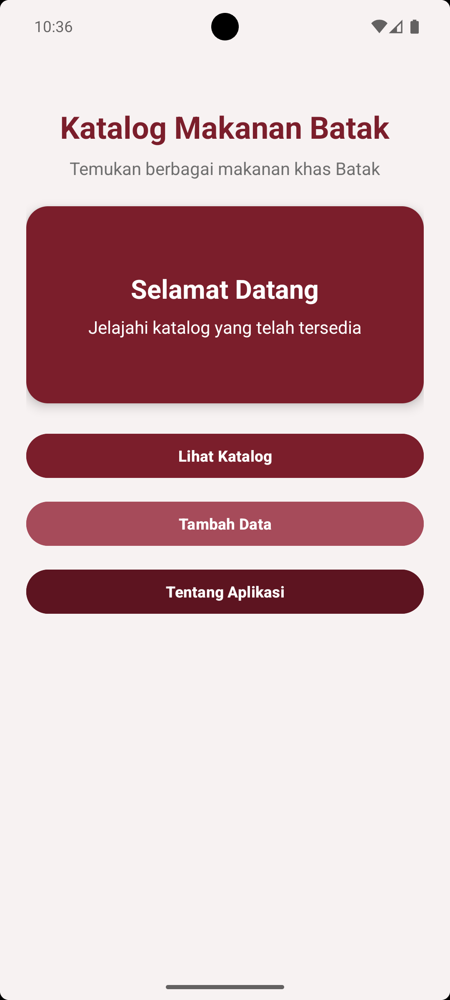
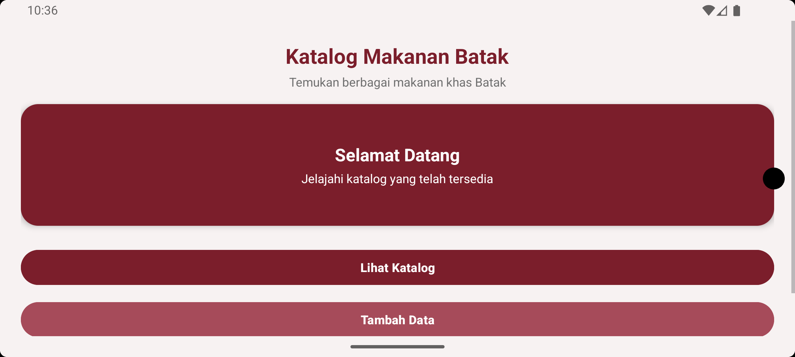
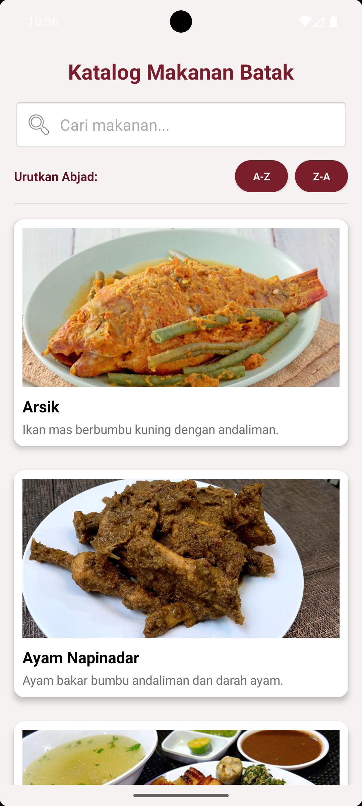
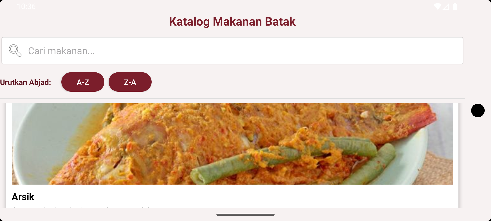
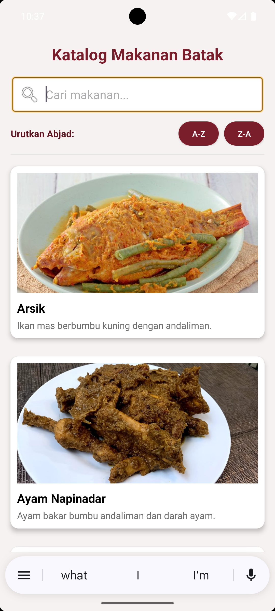
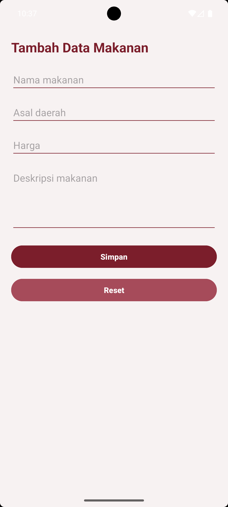
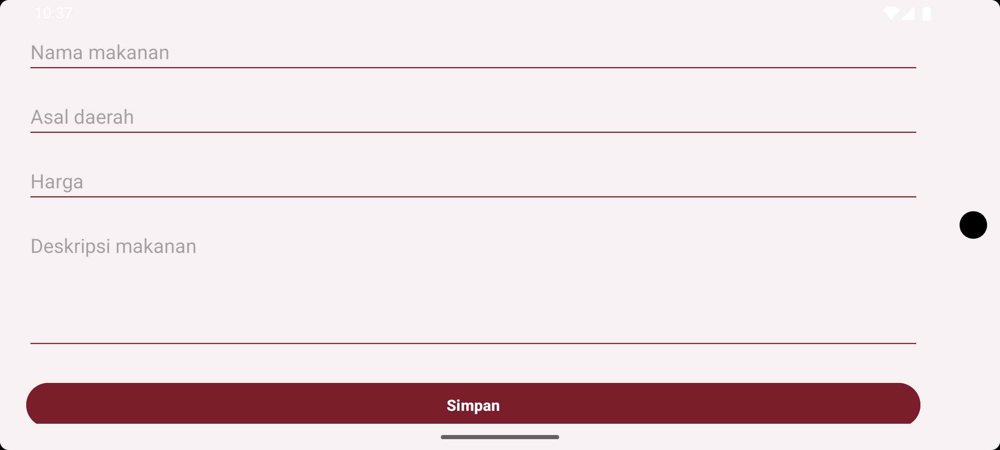
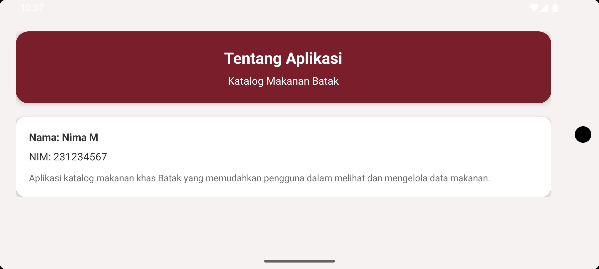
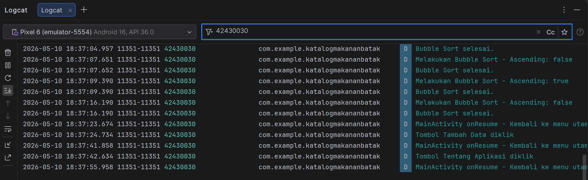

# UAS Pemrograman Seluler - Katalog Makanan Batak

**Nama Lengkap:** Yunima Dioranda Manik
**NIM:** 42430030

## Topik Aplikasi
Katalog Makanan Khas Batak

## Deskripsi Aplikasi
Aplikasi **Katalog Makanan Batak** adalah platform digital yang dirancang untuk memperkenalkan dan melestarikan kekayaan kuliner khas Batak. Aplikasi ini memungkinkan pengguna untuk menjelajahi daftar makanan khas Batak dengan antarmuka yang menarik dan informatif, serta mendukung pengelolaan data secara lokal tanpa memerlukan database eksternal.

## Pemenuhan Kebutuhan Modul
Berikut adalah implementasi fitur sesuai dengan instruksi yang diberikan:
- **Modul 2 & 3:** Desain UI yang rapi dan Responsif (Wajib memiliki tampilan yang menyesuaikan saat layar HP di-landscape).
- **Modul 4 & 5:** Terdapat perpindahan halaman (Intent) dan validasi If-Else pada kolom input.
- **Modul 6:** Menggunakan struktur data Array dan mengimplementasikan fitur Pencarian Data (Linear Search).
- **Modul 7:** Mengimplementasikan fitur Pengurutan Data dari A-Z dan Z-A menggunakan algoritma Bubble Sort.
- **Modul 9:** Memiliki penanganan Error (try-catch) dan merekam aktivitas aplikasi di latar belakang menggunakan Logcat (Gunakan NIM kalian sebagai Tag Logcat).

## Screenshots

### 1. Halaman Awal (Main Page)
Menampilkan sambutan dan menu navigasi utama.
| Portrait | Landscape |
| :---: | :---: |
|  |  |

### 2. Katalog Makanan (List Makanan)
Daftar lengkap makanan khas Batak yang tersedia.
| Portrait | Landscape |
| :---: | :---: |
|  |  |

### 3. Fitur Pencarian (Searching)
Implementasi **Linear Search** untuk menemukan makanan berdasarkan nama atau deskripsi.

### 4. Pengurutan Data (Sorting)
Implementasi **Bubble Sort** untuk mengurutkan data secara alfabetis.
| A-Z (Ascending) | Z-A (Descending) |
| :---: | :---: |
|  |  |

### 5. Tambah Data Makanan
Formulir dengan validasi If-Else untuk memasukkan data makanan baru.
| Portrait | Landscape |
| :---: | :---: |
|  |  |

### 6. Tentang Aplikasi
Informasi mengenai profil pengembang.
| Portrait | Landscape |
| :---: | :---: |
|  |  |

## Logcat (Identitas NIM)
Bukti aktivitas aplikasi di latar belakang dan penanganan error yang menampilkan NIM (42430030) sebagai Tag Logcat:

